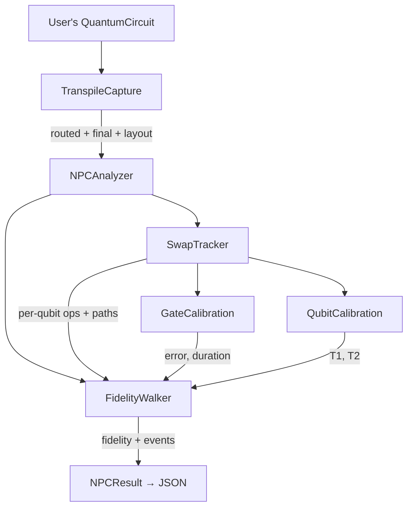

<h1 align="center">ProxyFidelity</h1>

<p align="center">
  <strong>Noise-Per-Channel (NPC) proxy fidelity estimator for quantum circuits.</strong>
</p>

<p align="center">
  
  
  
  
  
  
</p>

**ProxyFidelity** (package: `npc_analysis`) predicts per-qubit and circuit-level
fidelity for quantum circuits on IBM hardware — *without consuming any QPU time*.
It walks a transpiled circuit gate-by-gate on top of the backend's published
calibration data (gate error rates, T1/T2 relaxation times, readout errors) and
compounds the per-event fidelity drops into a single proxy for circuit success.

- **Documentation:** [`docs/`](docs/index.md) — built with [Zensical](https://zensical.org)
- **Getting started:** [`docs/getting-started.md`](docs/getting-started.md)
- **Data flow:** [`docs/data-flow.md`](docs/data-flow.md)
- **Module reference:** [`docs/modules.md`](docs/modules.md)
- **Noise models:** [`docs/noise-models.md`](docs/noise-models.md)
- **Source code:** [`src/npc_analysis/`](src/npc_analysis)
- **Bug reports:** open an issue in this repository

## Table of Contents

- [The Core Idea](#the-core-idea)
- [What You Get](#what-you-get)
- [Installation](#installation)
- [Quick Example](#quick-example)
- [Reading the Result](#reading-the-result)
- [How It Works](#how-it-works)
- [Noise Channels](#noise-channels)
- [Public API](#public-api)
- [Testing](#testing)
- [Project Layout](#project-layout)
- [License](#license)

## The Core Idea

After Qiskit transpiles a circuit for a specific IBM backend, every gate maps to
a physical qubit (or qubit pair) with known error rates. By compounding those
error contributions, you get a proxy for how faithful the output will be — no
hardware execution required.

ProxyFidelity also tracks **SWAP routing**: when the transpiler inserts SWAP
gates to move logical qubits across the chip, the tool decomposes those SWAPs
into their native gate sequences and accounts for the noise on *both* physical
qubits involved.

## What You Get

For any circuit + backend combination:

- **Circuit fidelity** — the product of all per-qubit fidelities; a single number estimating overall success probability.
- **Per-qubit fidelity** — each logical qubit's predicted fidelity after all of its gates and SWAPs.
- **Noise event trace** — every depolarizing, thermal-relaxation, readout, and SWAP noise event with before/after fidelity.
- **Qubit trajectories** — the physical path each logical qubit takes across the chip as SWAPs move it.
- **Calibration snapshots** — T1, T2, gate errors, and readout errors for every qubit and gate used.

## Installation

**Prerequisites:** Python 3.13+ and an IBM Quantum account (for backend
calibration data via `QiskitRuntimeService`).

The project is managed with [uv](https://docs.astral.sh/uv/). From the repository root:

```bash
uv sync
```

This creates `.venv/` and installs `npc_analysis` in editable mode. Run anything
with `uv run` (which uses the venv), e.g. `uv run python my_script.py`.

Pinned dependencies (resolved by `uv`):

- `qiskit >= 2.3.1`
- `qiskit-ibm-runtime >= 0.46.1`

## Quick Example

The one-shot helper transpiles and analyzes in a single call:

```python
from qiskit import QuantumCircuit
from qiskit_ibm_runtime import QiskitRuntimeService

from npc_analysis import analyze_circuit

qc = QuantumCircuit(3)
qc.h(0)
qc.cx(0, 1)
qc.cx(1, 2)
qc.measure_all()

backend = QiskitRuntimeService().backend("ibm_kingston")
result = analyze_circuit(backend, qc, output_path="results/my_analysis.json")

print(f"Predicted circuit fidelity: {result.circuit_fidelity:.4f}")
for v, qfr in result.per_qubit.items():
    print(f"  qubit {v}: {qfr.fidelity:.4f}  ({len(qfr.events)} noise events)")
```

> [!IMPORTANT]
> The proxy assumes intact SWAP boundaries (3 native 2q gates per SWAP), so
> `analyze_circuit` defaults to `optimization_level=0`. Raise it only if you are
> confident 1-qubit optimization will not fold gates across a SWAP boundary.

Need custom layout/routing, or want to inspect the captured circuits? Drive
`TranspileCapture` and `NPCAnalyzer` directly — see
[Getting Started](docs/getting-started.md#option-b--manual-transpile--analyze).

## Reading the Result

`analyze_circuit(...)` (and `NPCAnalyzer.analyze()`) return an `NPCResult`:

| Attribute | Type | Description |
|-----------|------|-------------|
| `circuit_fidelity` | `float` | Product of all per-qubit fidelities |
| `per_qubit` | `dict[int, QubitFidelityResult]` | Virtual qubit → `(fidelity, events)` |
| `native_2q_gate` | `str` | Backend's native 2q gate (e.g. `"cz"`) |
| `initial_layout` | `list[int]` | Virtual→physical mapping after the layout pass |
| `final_layout` | `dict[int, int]` | Virtual→physical after all SWAPs |
| `qubit_details` | `dict[int, dict]` | Per-qubit `path`, `location`, `ops` |
| `qubit_calibrations` | `dict` | T1 / T2 / readout error per physical qubit used |
| `gate_calibrations` | `dict` | Error / duration / depolarizing probability per gate used |

Tracing is always on, so every `QubitFidelityResult` carries the full event
list. Dump JSON with `result.to_json()` (also written automatically when
`output_path` is set).

## How It Works



A **layout tripwire** guards correctness: `analyze()` compares the
`SwapTracker`'s final qubit locations against Qiskit's `TranspileLayout` and
raises `AssertionError` on disagreement — surfacing a misrouted analysis loudly
rather than returning silently wrong fidelity numbers. See
[Getting Started → Layout Tripwire](docs/getting-started.md#layout-tripwire).

## Noise Channels

Four channels are applied during the walk. The math lives as static methods on
`FidelityWalker`; see [Noise Models](docs/noise-models.md) for the full
derivations.

| Channel | When | Effect |
|---------|------|--------|
| **Depolarizing** | After every non-virtual gate with non-zero depolarizing probability | Pushes the state toward the maximally mixed state ($f = 0.5$) |
| **Thermal relaxation** | After every gate with non-zero duration (T1 *and* T2 known) | Coherence loss while the gate physically executes |
| **SWAP (mini-NPC)** | At the last op of each SWAP segment | Walks both physical qubits through the native SWAP decomposition, then averages |
| **Readout** | Once per qubit at measurement | Classical mis-identification of the measured state |

Overall circuit fidelity is the product of per-qubit fidelities,
$F_{circuit} = \prod_v f_v$, assuming independent per-qubit noise — a standard,
fast NPC approximation. Virtual gates (e.g. `rz`) carry zero duration and zero
depolarizing probability and are skipped entirely.

## Public API

Everything below is re-exported from the `npc_analysis` package root:

| Symbol | Kind | Role |
|--------|------|------|
| `analyze_circuit` | function | One-shot transpile + analyze helper |
| `NPCAnalyzer` | class | Top-level orchestrator |
| `NPCResult` | dataclass | Analysis output (see above) |
| `TranspileCapture` | class | Pass-manager callback that snapshots circuits + layout |
| `FidelityWalker` | class | Core noise application + per-qubit walk |
| `SwapTracker` | class | Classifies gates and tracks qubit trajectories |
| `CircuitFidelityResult`, `QubitFidelityResult` | dataclass | Per-circuit / per-qubit results |
| `DepolarizingEvent`, `ThermalRelaxationEvent`, `ReadoutEvent`, `SwapNoiseEvent` | dataclass | Noise-event records |

Full per-module documentation: [Module Reference](docs/modules.md).

## Testing

```bash
uv run pytest
```

Tests live in [`tests/`](tests) and exercise the analyzer, fidelity walker,
SWAP tracker, SWAP decomposition check, and the transpile callback.

## Project Layout

```
src/npc_analysis/   # the package (public API re-exported from __init__.py)
docs/               # Zensical documentation source (Markdown)
tests/              # pytest suite
pyproject.toml      # project metadata + dependencies
zensical.toml       # documentation site configuration
```

## License

No license has been declared yet — this is an internal research project of the
**Wu Quantum Computing Lab**. Treat the code as "all rights reserved" until a
`LICENSE` file is added. If you intend to use or distribute it, contact the
maintainers.
