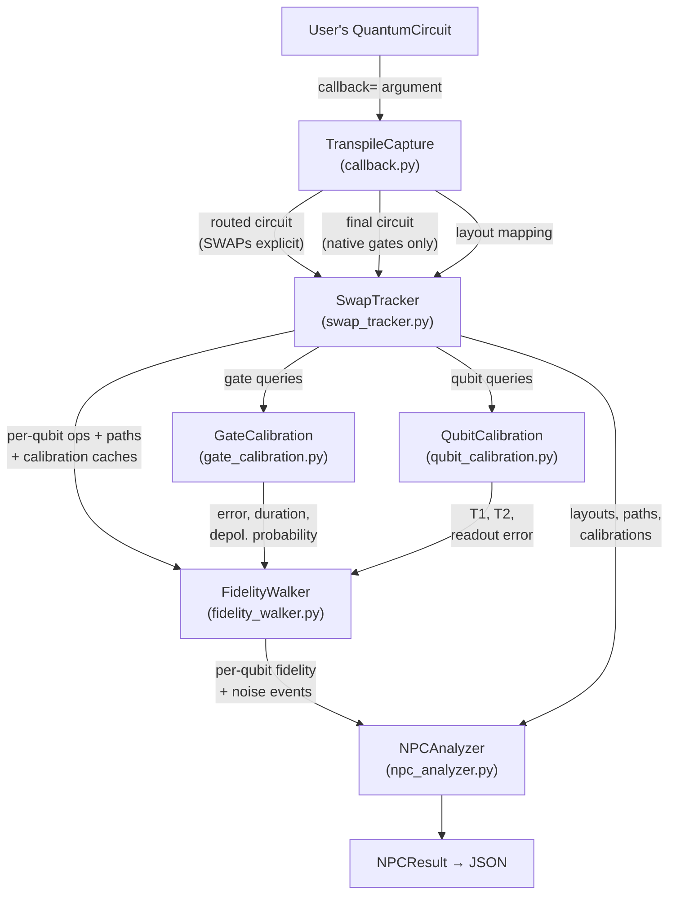
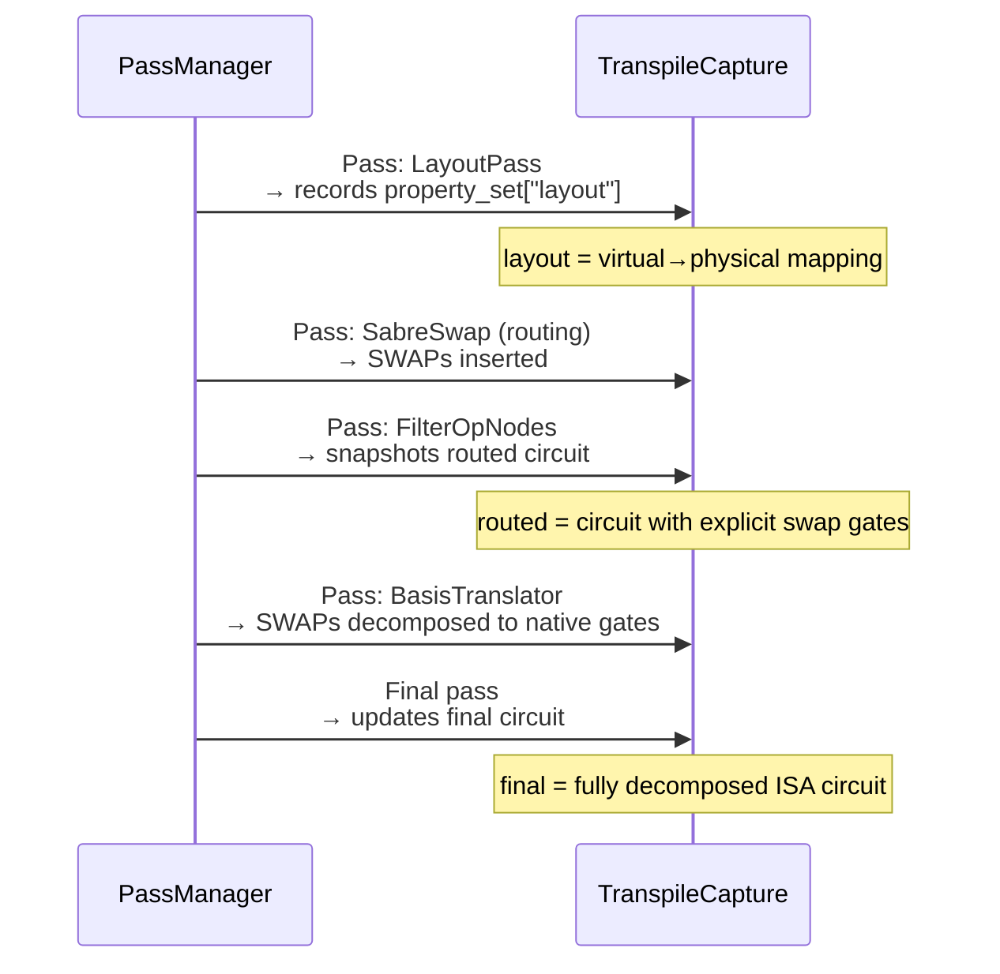
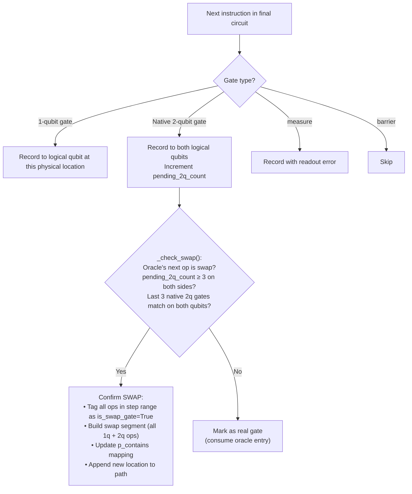
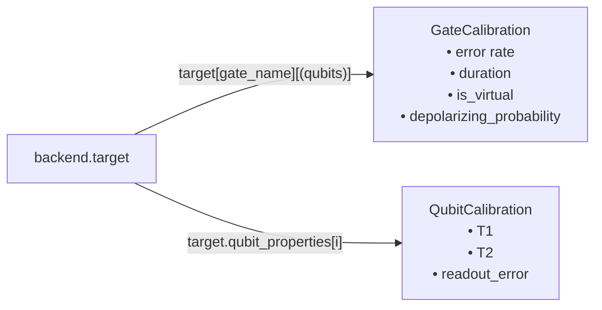
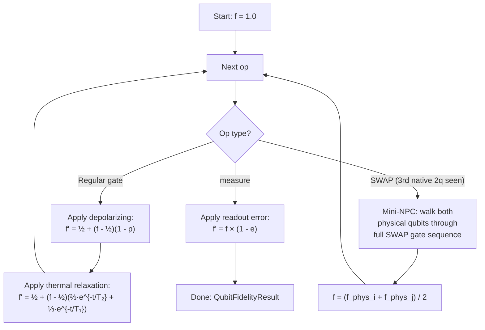
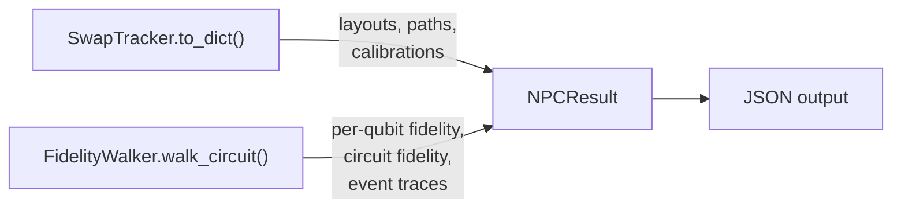

# Data Flow

This page traces how data moves through the NPCProxyFidelity pipeline, from user circuit to final JSON.

## End-to-End Flow



All modules live under `src/npc_analysis/` and are re-exported from the `npc_analysis` package root.

## Phase 1: Transpilation Capture

**File:** `src/npc_analysis/callback.py`

When Qiskit's pass manager runs, it invokes the callback after every compiler pass. `TranspileCapture` intercepts two moments:



**What each captured artifact contains:**

| Artifact | Gates present | SWAPs visible as | Used by |
|----------|--------------|-------------------|---------|
| `routed` | Mix of original + `swap` | Explicit `swap` instructions | SwapTracker (oracle) |
| `final` | Native only (`cz`, `sx`, `rz`, ...) | 3× native 2q gates | SwapTracker (main walk) |
| `layout` | N/A | N/A | SwapTracker (initial mapping fallback) |

`TranspileCapture.initial_index_layout()` mirrors Qiskit's `TranspileLayout.initial_index_layout(filter_ancillas=True)` for the raw `Layout` object — only the user's input qubits are returned, ancillas are filtered out.

## Phase 2: SWAP Tracking

**File:** `src/npc_analysis/swap_tracker.py`

The `SwapTracker` does two passes:

### Pass A — Build the oracle

Walks the **routed** circuit and builds per-qubit queues of expected 2-qubit operations:

```
Virtual qubit 0: [("cx", (3, 5)), ("swap", (5, 4)), ("cx", (4, 7))]
Virtual qubit 1: [("cx", (3, 5)), ("swap", (5, 4))]
...
```

### Pass B — Walk the final circuit

Walks the **final** circuit instruction by instruction. For each gate:



**Per-logical-qubit state (`Qinfo`):**

| Field | Example | Purpose |
|-------|---------|---------|
| `path` | `[0, 1, 2, 3, 4, 3]` | Physical locations over time |
| `ops` | List of `{name, qubits, step_index, is_swap_gate, is_virtual}` | Full gate history |
| `swap_segments` | `[{phys_i: 2, phys_j: 3, all_ops: [...]}]` | Native gate sequences per SWAP |
| `meas_error` | `0.0123` | Readout error at final location |

## Phase 3: Calibration Lookup

**Files:** `gate_calibration.py`, `qubit_calibration.py`

Both are pulled from `backend.target` and cached on the SwapTracker:



**Virtual gates** (e.g. `rz`) have `duration is None` or `duration == 0.0` — they're frame changes in software, not physical pulses. They contribute zero noise.

**Depolarizing probability** converts the raw error rate:

$$p = r \times \frac{d}{d-1}, \quad d = 2^{n_{qubits}}$$

For 1-qubit gates: $p = 2r$. For 2-qubit gates: $p = \frac{4}{3}r$.

## Phase 4: Fidelity Walk

**File:** `src/npc_analysis/fidelity_walker.py`

For each logical qubit, the walker starts at $f = 1.0$ and processes every operation in sequence:



### SWAP Mini-NPC

When a SWAP is confirmed (3rd swap-tagged native 2q gate seen on this qubit), the walker does **not** apply a single error. It runs a "mini-NPC" that walks **both** physical qubits through the SWAP's full native gate sequence independently:

```
Physical qubit i: f_i = apply_gate_noise(f, op1) → apply_gate_noise(f_i, op2) → ...
Physical qubit j: f_j = apply_gate_noise(f, op1) → apply_gate_noise(f_j, op2) → ...
Final: f = (f_i + f_j) / 2
```

The average reflects that, after the SWAP, the logical qubit's state has been physically moved — and both physical qubits' noise histories contributed.

## Phase 5: Result Assembly

**File:** `src/npc_analysis/npc_analyzer.py`

`NPCAnalyzer.analyze()` ties everything together:



Before assembling the result, `analyze()` runs a **layout tripwire**: it compares the tracker's final per-qubit locations against `cap.final.layout.final_index_layout(filter_ancillas=True)`. A mismatch raises `AssertionError`, because pulling readout / T1 / T2 from the wrong physical qubit would silently produce wrong fidelity numbers.

The final JSON looks like:

```json
{
  "circuit_fidelity": 0.4919,
  "native_2q_gate": "cz",
  "initial_layout": [0, 1, 2, ...],
  "final_layout": {"0": 3, "1": 0, ...},
  "per_qubit": {
    "0": {
      "fidelity": 0.9712,
      "path": [0, 1, 2, 3, 4, 3],
      "location": 3,
      "events": [
        {"type": "depolarizing", "gate": "sx", "p": 0.00038, "f_before": 1.0, "f_after": 0.9998},
        {"type": "thermal_relaxation", "gate": "sx", "duration": 2.6e-8, "t1": 1.5e-4, "t2": 1.1e-4, "physical_qubit": 0, "f_before": 0.9998, "f_after": 0.9997},
        {"type": "swap", "physical_qubits": [0, 1], "native_ops": [...], "f_before": 0.99, "f_phys_i": 0.985, "f_phys_j": 0.984, "f_after": 0.9845},
        {"type": "readout", "physical_qubit": 3, "error": 0.012, "f_before": 0.97, "f_after": 0.96}
      ]
    }
  },
  "qubit_calibrations": { "0": {"physical_index": 0, "t1": 1.5e-4, "t2": 1.1e-4, "readout_error": 0.012}, ... },
  "gate_calibrations": { "sx[0]": {"name": "sx", "qubits": [0], "error": 0.00019, "duration": 2.6e-8, "is_virtual": false, "depolarizing_probability": 0.00038}, ... }
}
```
