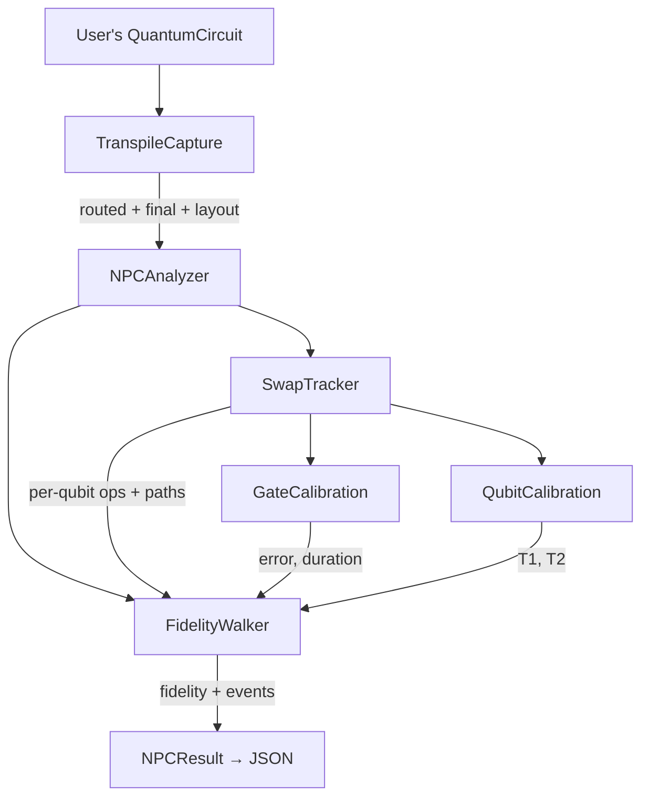

# NPCProxyFidelity

**Noise-Per-Channel proxy fidelity estimator for quantum circuits.**

NPCProxyFidelity predicts per-qubit and circuit-level fidelity by walking through a transpiled circuit gate-by-gate and applying the backend's calibration data — gate error rates, T1/T2 relaxation times, and readout errors. No QPU time required.

## The Core Idea

After Qiskit transpiles a circuit for a specific IBM backend, every gate maps to a physical qubit pair with known error rates. By compounding these error contributions, you get a proxy for how faithful the output will be.

The tool also tracks **SWAP routing**: when the transpiler inserts SWAP gates to move logical qubits across the chip, NPCProxyFidelity decomposes those SWAPs into their native gate sequences and accounts for the noise on both physical qubits involved.

## What You Get

For any circuit + backend combination:

- **Circuit fidelity** — the product of all per-qubit fidelities (a single number estimating overall success probability)
- **Per-qubit fidelity** — each logical qubit's predicted fidelity after all its gates and SWAPs
- **Noise event trace** — every depolarizing, thermal relaxation, readout, and SWAP noise event with before/after fidelity
- **Qubit trajectories** — the physical path each logical qubit takes across the chip as SWAPs move it
- **Calibration snapshots** — T1, T2, gate errors, and readout errors for every qubit and gate used

## Quick Example

The one-shot helper transpiles and analyzes in a single call:

```python
from qiskit import QuantumCircuit
from qiskit_ibm_runtime import QiskitRuntimeService

from npc_analysis import analyze_circuit

qc = QuantumCircuit(3)
qc.h(0)
qc.cx(0, 1)
qc.cx(1, 2)
qc.measure_all()

backend = QiskitRuntimeService().backend("ibm_kingston")
result = analyze_circuit(backend, qc, output_path="results/my_analysis.json")

print(f"Predicted circuit fidelity: {result.circuit_fidelity:.4f}")
for v, qfr in result.per_qubit.items():
    print(f"  qubit {v}: {qfr.fidelity:.4f}  ({len(qfr.events)} noise events)")
```

If you need to control transpilation yourself, build a `TranspileCapture` and pass it to `NPCAnalyzer` directly — see [Getting Started](getting-started.md).

## Architecture at a Glance


